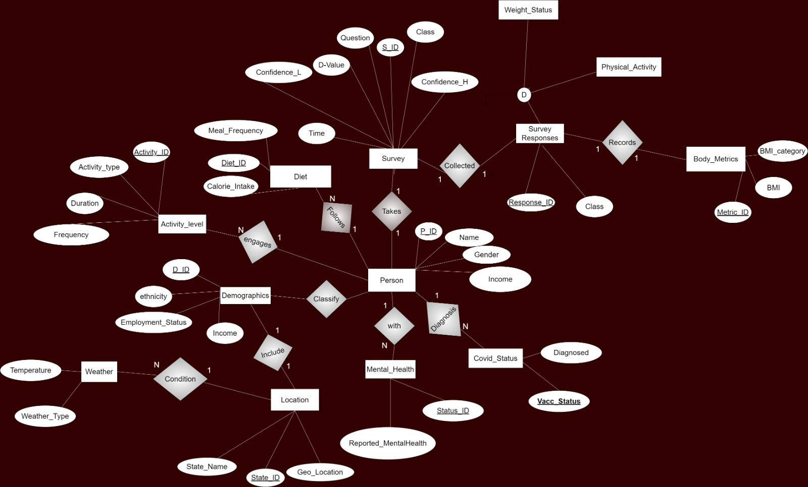
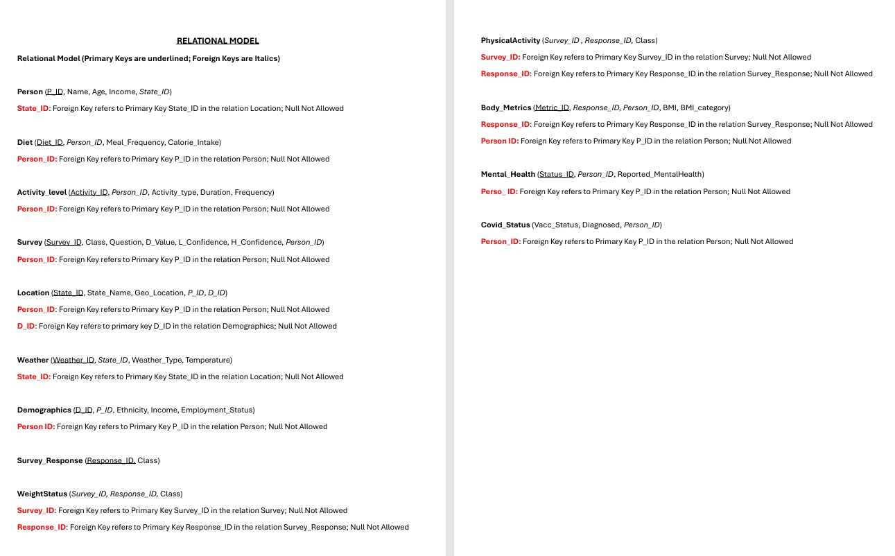
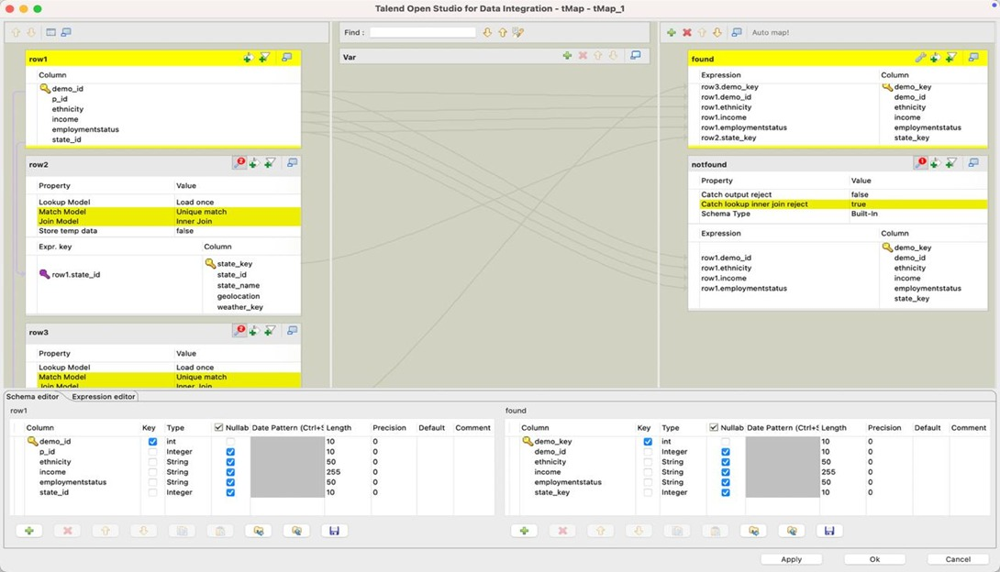
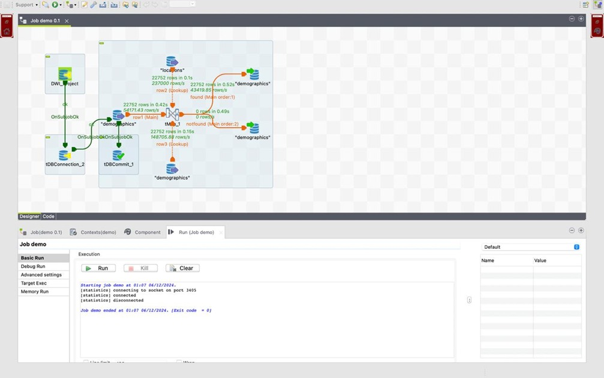
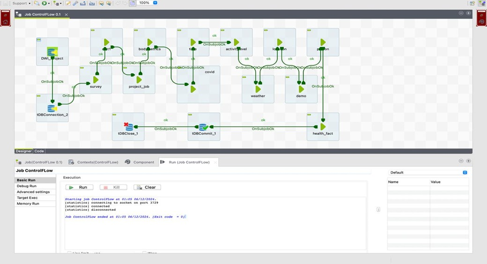
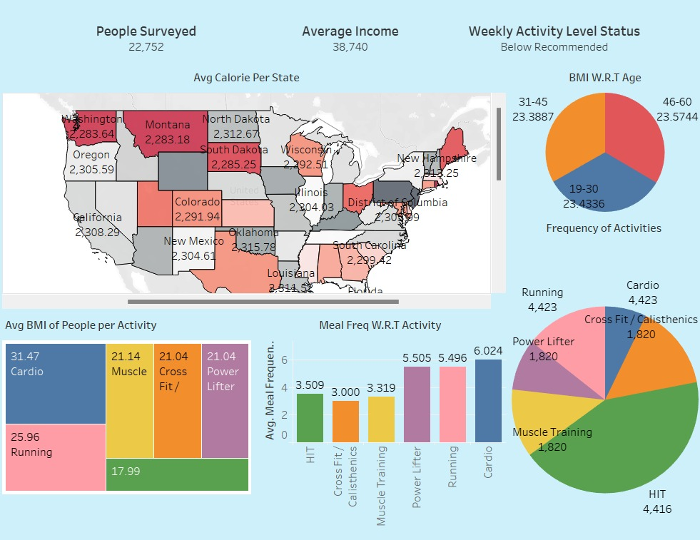
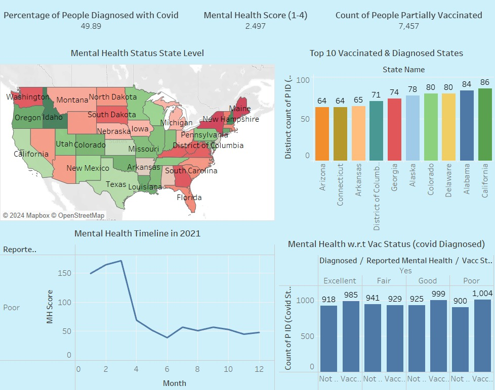

# 🧠 BRFSS Health Analytics: ETL Pipeline & Tableau Dashboard 📊🏥  

## Project Overview  

This project focuses on building a complete **ETL (Extract, Transform, Load) pipeline** using the **Behavioral Risk Factor Surveillance System (BRFSS)** dataset to analyze trends in obesity, nutrition, and physical activity across the United States.  

The project combines **data engineering, cloud architecture, and visualization** to transform complex healthcare data into actionable insights using **AWS, SQL, Python, and Tableau**.

---

## Problem Statement 🎯  

Obesity and poor nutrition are major public health challenges in the U.S., contributing to chronic diseases such as diabetes and heart disease.  

Although BRFSS provides rich health-related data, it is difficult to use due to:  
- Missing values  
- Inconsistent formats  
- State-level data variations  

This project builds a **scalable ETL pipeline** to clean, structure, and visualize the data for better decision-making.  

---

## Tech Stack 🛠️  

- **Python** – Data extraction & transformation  
- **Excel** – Initial preprocessing  
- **SQL / PostgreSQL** – Database design  
- **Tableau** – Visualization  
- **AWS (S3, Lambda, Athena)** – Cloud data pipeline  

---

## Data Architecture 🗂️  

### EER Model  
 ⁠

---

### Relational Schema  
 ⁠

---

## ETL Process 🔄  

### Data Manipulation Flow  
 ⁠

---
### ETL Workflow  

**Pipeline Flow:**  
- **S3 (Raw Layer):** Stores unprocessed BRFSS data  
- **Lambda:** Automates data transformation and cleaning  
- **S3 (Processed Layer):** Stores cleaned datasets  
- **Athena:** Enables SQL-based querying directly on S3  
- **Tableau:** Connects to Athena/processed data for visualization

   ⁠

---

### Final ETL Job Workflow  
 ⁠

---

## Tableau Dashboards 📊  

### Dashboard 1: Health Trends Overview  
 ⁠

---

### Dashboard 2: Demographic & State Analysis  
 ⁠

---

## Key Insights 💡  

- Obesity trends vary significantly across states  
- Physical activity strongly impacts BMI categories  
- Certain demographics are at higher risk  
- Regional disparities highlight need for targeted healthcare policies  

---

## Trends & Analysis 📈  

1. **Geographical Variation:** State-level differences in obesity rates  
2. **Lifestyle Impact:** Nutrition and activity influence health outcomes  
3. **Demographic Trends:** Age and gender affect risk patterns  
4. **Cloud Efficiency:** AWS pipeline enables scalable and automated processing  

---

## Recommendations 🚀  

### Public Health  
- Target high-risk states with awareness programs  
- Promote physical activity and nutrition initiatives  

### Data Engineering  
- Implement real-time streaming pipelines (Kinesis)  
- Automate ETL scheduling using AWS EventBridge  

### Analytics  
- Apply predictive modeling for obesity risk  
- Expand dashboards for policy-level insights  

---

## Conclusion 🧠  

This project demonstrates how combining **ETL pipelines, cloud infrastructure, and visualization tools** can transform raw healthcare data into actionable insights.  

By leveraging **AWS (S3, Lambda, Athena)** along with traditional analytics tools, the solution enables scalable, efficient, and data-driven decision-making in public health.

---

## Future Improvements 🔮  

- Real-time data ingestion pipeline  
- Machine learning models for health prediction  
- Advanced geospatial analytics  
- Fully automated cloud-native data warehouse
